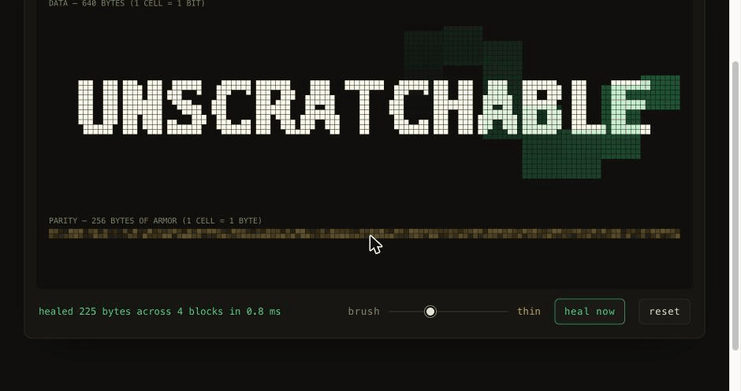
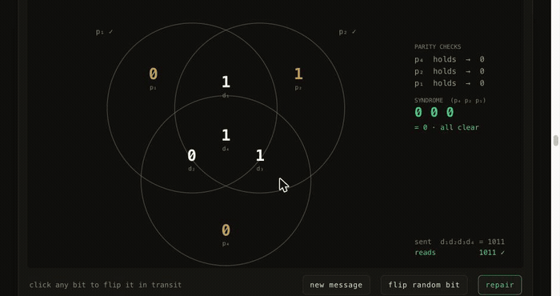

<div align="center">

# unscratchable

**Scratch this message. It heals.**

An interactive essay on error-correcting codes —
from parity bits to Reed–Solomon — with zero dependencies.

[](https://cleoanka.github.io/unscratchable/)

[](https://github.com/cleoanka/unscratchable/actions/workflows/test.yml)


[](LICENSE)



</div>

---

The message above was not restored from a backup. The bytes under the brush were
overwritten with garbage — *gone* — and the survivors held enough structure to name
every missing byte and compute every one of their values back into existence.

That trick guards every QR code you scan, every SSD you own, every photo Voyager 1
has sent from interstellar space. **unscratchable** is an interactive essay that
teaches how it works by handing you the brush: you are the noise. Every figure is
honest — the math on screen is the math in the source, running live in your browser.

## The eight chapters

| # | Chapter | You will… |
|---|---------|-----------|
| 0 | **The unscratchable message** | Gouge a real Reed–Solomon-armored payload and watch it heal — or push past the budget and watch it honestly fail. |
| 1 | **A world that flips bits** | Corrupt a five-letter word with a noise slider, one bit at a time. |
| 2 | **Say everything three times** | Meet the repetition code, its majority vote, its brutal price — and beat it with two clicks. |
| 3 | **Distance is safety** | Rotate the 3-bit cube and see decoding spheres tile it perfectly. |
| 4 | **Seven bits, one confession** | Flip any bit of a Hamming(7,4) codeword; the broken parity circles spell out the culprit's address in binary. |
| 5 | **The scratch problem** | Drag one scratch across two storage layouts; interleaving dilutes the fatal into the trivial. |
| 6 | **Any k points** | Drag a parabola's message points, destroy any four of seven samples, and recover the curve exactly. |
| 7 | **The healing machine** | Open the hood: your message, your redundancy dial, erasures vs. silent corruption — feel the factor of two. |

<div align="center">

</div>

## What is really running

The decoder under the hero is a complete Reed–Solomon **errors-and-erasures**
pipeline over GF(2⁸), implemented in about 300 readable lines with no dependencies:

```
syndromes → Forney syndromes → Berlekamp–Massey → Chien search → Forney algorithm
```

- [`js/gf256.js`](js/gf256.js) — the 256-element finite field (poly `0x11D`, α = 2) and its polynomial arithmetic
- [`js/rs.js`](js/rs.js) — systematic RS encode + decode; any mix of `2·errors + erasures ≤ parity` heals
- [`js/codec.js`](js/codec.js) — block striping + column interleaving, so one contiguous scratch is shredded across all blocks (the reason CDs shrug off gouges)
- [`js/hamming.js`](js/hamming.js) — Hamming(7,4) with syndrome decoding, drawn as the classic three-circle Venn
- [`js/widgets/`](js/widgets/) — one canvas figure per chapter on a shared chassis (DPR-aware, touch-friendly, pauses off-screen, honors `prefers-reduced-motion`)

No frameworks, no build step, no analytics, no network calls. `index.html` + CSS + ES modules, served as-is.

## Honesty guarantees

- The hero canvas is a literal view of storage: every cell is drawn *from the stored bytes*. The brush overwrites real bytes; healing runs the real decoder. Timings shown are real `performance.now()` measurements.
- Failure is never hidden: exceed a block's parity budget and the loss is reported and left visible as wreckage.
- The correctness of the math is enforced by property tests — thousands of seeded random corruptions at every legal error/erasure budget, plus exact-boundary and beyond-budget cases:

```sh
npm test          # = node --test  (Node ≥ 20, no packages needed)
```

## Run it locally

```sh
git clone https://github.com/cleoanka/unscratchable
cd unscratchable
python3 -m http.server 8907    # any static server works
open http://localhost:8907
```

`?demo=1` plays a scripted scratch-and-heal loop on the hero (used to record the GIF above).

## Further reading

- R. W. Hamming, *Error Detecting and Error Correcting Codes*, Bell System Technical Journal (1950)
- I. S. Reed & G. Solomon, *Polynomial Codes over Certain Finite Fields*, J. SIAM (1960) — five quiet pages
- E. R. Berlekamp, *Algebraic Coding Theory* (1968); J. L. Massey, *Shift-Register Synthesis and BCH Decoding* (1969)
- [Reed–Solomon codes for coders](https://en.wikiversity.org/wiki/Reed%E2%80%93Solomon_codes_for_coders) — the classic implementation on-ramp
- 3Blue1Brown's [Hamming codes](https://www.youtube.com/watch?v=X8jsijhllIA) pair of videos

## License

[MIT](LICENSE). Scratch it all you like.
